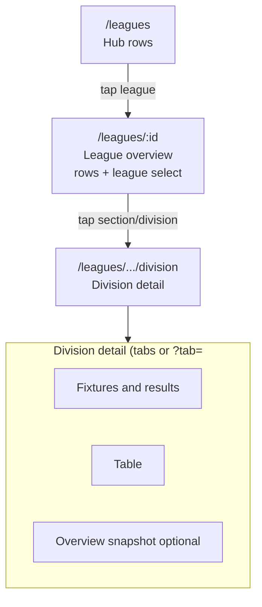

# Leagues UX sketch — FotMob-inspired hub + detail

**Status (app):** The public leagues area now uses a **hub at `/leagues`**, a **shell bar** (back link + league/section/division `<select>`s), **big tap rows** for sections/divisions, and **division detail tabs** via **`?tab=fixtures|table|overview`** (default fixtures). See `src/pages/LeaguesPage.jsx` and related components.

Reference screenshots (saved with the Cursor project assets folder for this workspace):  
`/Users/andyw/.cursor/projects/Users-andyw-bowls-web/assets/Screenshot_2026-05-25_at_4.09.29_PM-ea7ca9c6-5232-446d-8ce0-6b4cd53ec02d.png`,  
`/Users/andyw/.cursor/projects/Users-andyw-bowls-web/assets/Screenshot_2026-05-25_at_4.09.35_PM-67b1a7a8-b579-4b16-93a1-021abb90f895.png`.

## Goals

- Fewer competing **pill strips**; favor **menus / dropdowns / expandable rows**.
- **At-a-glance** league list (`/leagues`) before drilling into divisions.
- **Detail** screens with **tabs** (Table | Fixtures | …) like FotMob.
- Larger targets and simpler copy for **65+**.

---

## Current routes (baseline)

These already exist and should keep working via redirects when you refactor.

| Path | Behaviour today |
|------|------------------|
| `/leagues` | No league selected; pills empty / hint |
| `/leagues/:leagueId` | League selected; section/division pills |
| `/leagues/:leagueId/:sectionOrDivisionId` | Section OR flat division slug |
| `/leagues/:leagueId/:sectionId/:divisionId` | Full selection → fixtures + table + snapshot |

Canonical key for division data stays: **`leagueId` + `sectionId` (optional) + `divisionId`**.

---

## Proposed route map

### Tier 1 — Hub (new emphasis)

| Path | Screen |
|------|--------|
| **`GET /leagues`** | **Leagues hub**: scrollable rows (one card per league in `leagues-nav.json`). Each row shows label, tiny meta (season year), badge e.g. “3 divisions”, chevron → `GET /leagues/:leagueId`. |

Optional enhancement (not required day one):

| Path | Screen |
|------|--------|
| `GET /leagues?q=samford` | Pre-filter hub list (later; start with Ctrl+F friendly copy). |

### Tier 2 — League shell

| Path | Screen |
|------|--------|
| **`GET /leagues/:leagueId`** | **League overview**. If structured league: **list sections** as FotMob-like rows (“Monday Evening ▸ 5 divisions”). If flat: **list divisions** as rows with badges (“8 teams”, “Round 6”). Selecting a row navigates to Tier 3. **Replace triple pill strips** with: (1) back link “All leagues”; (2) **League** `<select>` in header sticky bar (switch league in one gesture). |

### Tier 3 — Competition (division) detail

Pick **one** URL strategy (both are sketch-level valid).

#### Option A — Tabs as **query** (minimal router churn)

| Path | Screen |
|------|--------|
| **`GET /leagues/:leagueId/:sectionId/:divisionId`** | Default tab content (suggest **Fixtures & results** first — most visitors want “what’s on”). |
| Same + **`?tab=table`** | **Table** panel only (scroll y). |
| Same + **`?tab=fixtures`** | Fixtures list (combined or split by submenu). |

Pros: reuse single `LeaguesPage` subtree; bookmarks work; shallow diff.  
Cons: tabs not in path segment.

#### Option B — Tabs as **segments** (shareable FotMob URLs)

| Path | Screen |
|------|--------|
| `GET /leagues/:leagueId/:sectionId/:divisionId` | Redirect to **`.../fixtures`** or render default tab |
| **`.../fixtures`** | Fixtures & results (+ week/date controls). |
| **`.../table`** | Standings (full width card). |
| **`.../overview`** | Snapshot / “last week / next week” summary only (optional). |

Pros: FotMob-readable URLs; clear mental model.  
Cons: refactor `Routes` → nested `<Outlet />` layout component.

Recommended: start **Option A** (`?tab=`), migrate to Option B only if analytics show heavy tab sharing.

### Redirects compatibility

Keep old behaviour working:

- From hub row or league overview, link with **full Tier 3** path you already generate (`sections` ⇒ three segments; flat ⇒ two segments).

---

## Information architecture (diagram)



---

## ASCII mockups

### Hub `/leagues`

```
┌─────────────────────────────────────────────────────┐
│  ◀ Bowls NZ          [ Search leagues ________ 🔍 ]  │  ← optional phase 2
├─────────────────────────────────────────────────────┤
│                                                      │
│  Leagues                                             │
│  Pick a competition to view fixtures and tables.      │
│                                                      │
│ ┌──────────────────────────────────────────────────┐│
│ │ 🏟  Samford League 2026              [ 3 comps ] ›││
│ └──────────────────────────────────────────────────┘│
│ ┌──────────────────────────────────────────────────┐│
│ │ 🏟  Two Wood League 2026             [ 2 comps ] ›││
│ └──────────────────────────────────────────────────┘│
│ ┌──────────────────────────────────────────────────┐│
│ │ 🏟  Triples League 2026               [ 1 comp ] ›││
│ └──────────────────────────────────────────────────┘│
│                                                      │
└─────────────────────────────────────────────────────┘
```

### League `/leagues/samford-2026`

```
┌─────────────────────────────────────────────────────┐
│  ← All leagues     League: [ Samford League 2026 ▼ ] │
├─────────────────────────────────────────────────────┤
│                                                      │
│  Samford League 2026                                 │
│  Choose a competition                                │
│                                                      │
│ ┌──────────────────────────────────────────────────┐│
│ │  Monday Evening                    [ 5 divs ]  ▼ ││ ← expand OR tap row
│ └──────────────────────────────────────────────────┘│
│ ┌──────────────────────────────────────────────────┐│
│ │  Tuesday Triples                   [ 4 divs ]  ▼ ││
│ └──────────────────────────────────────────────────┘│
│                                                      │
│  ── Or jump directly: [ Section ▼ ] [ Division ▼ ]  │ ← two labelled selects
│                                                      │
└─────────────────────────────────────────────────────┘
```

### Division detail with tabs (`?tab=` or `/fixtures`)

```
┌─────────────────────────────────────────────────────┐
│  ← Samford 2026   Monday Evening › Division One      │
├─────────────────────────────────────────────────────┤
│                                                      │
│  Division One                                         │
│  ┌────────────────┬────────────────┬─────────────┐    │
│  │ Fixtures      │ Table          │ Overview    │    │ ← heavy underline active
│  └────────────────┴────────────────┴─────────────┘    │
│                                                      │
│  Week: ◀ [ Round 8 — Sat 24 May ▼ ] ▶               │ ← FotMob-like date/week
│  Show: [ All rounds ▼ ]     Filter: [ Team ▼ ]       │ ← menus replace pill trio
│                                                      │
│ ┌──────────────────────────────────────────────────┐│
│ │ HOME              RINK        AWAY         SCORE  ││
│ │ Pukekohe …        vs    …                         ││
│ └──────────────────────────────────────────────────┘│
│                                                      │
└─────────────────────────────────────────────────────┘
```

### Table tab (future accent + form pills)

```
   # │     Team          │ P │ For │ Agt │ Pts │   Form
 ────┼───────────────────┼───┼─────┼─────┼─────┼────────────
 ██1 │ 🔵 Matakohe      │ 6 │ …   │ …   │ 12  │ ●W ●W ●L
 ██2 │ 🔵 Dairy Flat    │ 6 │ …   │ …   │ 11  │ ●D ●W ●W
```

`██` optional rank accent (colour by zone). `●W●L●D` FotMob-style; only if data exists.

---

## Component refactor map (engineering hint)

| Current | Direction |
|---------|-----------|
| Three `PillNav` stacks on `LeaguesPage` | Hub page component + **`LeagueCompetitionPicker`** (selects or accordion rows) |
| `FixtureListModeNav` pills | Single **`fixturesScope` `<select>`** or week-first navigation |
| `LeagueWeekSnapshot` + `StandingsTable` stacked | Moved under **`?tab=`** or child routes |

---

## Open decisions

1. Default tab after choosing division: **Fixtures** vs **Overview** snapshot (survey captains?)
2. Whether **nested routes** justify the larger `Outlet` refactor now or Phase 2.
3. Imagery: club **colours bar** beside team name sooner than crests (no asset pipeline).

---

## Static HTML mockup

A non-production, browser-openable sketch lives at:

**`docs/mockups/leagues-fotmob-hub.html`**

Double-click or `open docs/mockups/leagues-fotmob-hub.html` to review layout/spacing (placeholder copy only).
